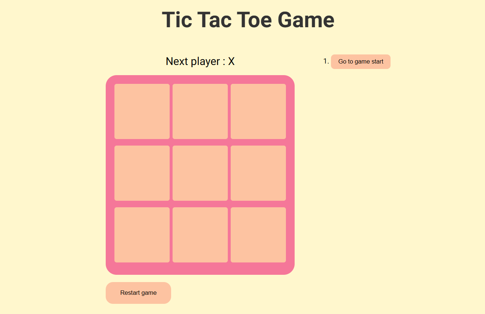
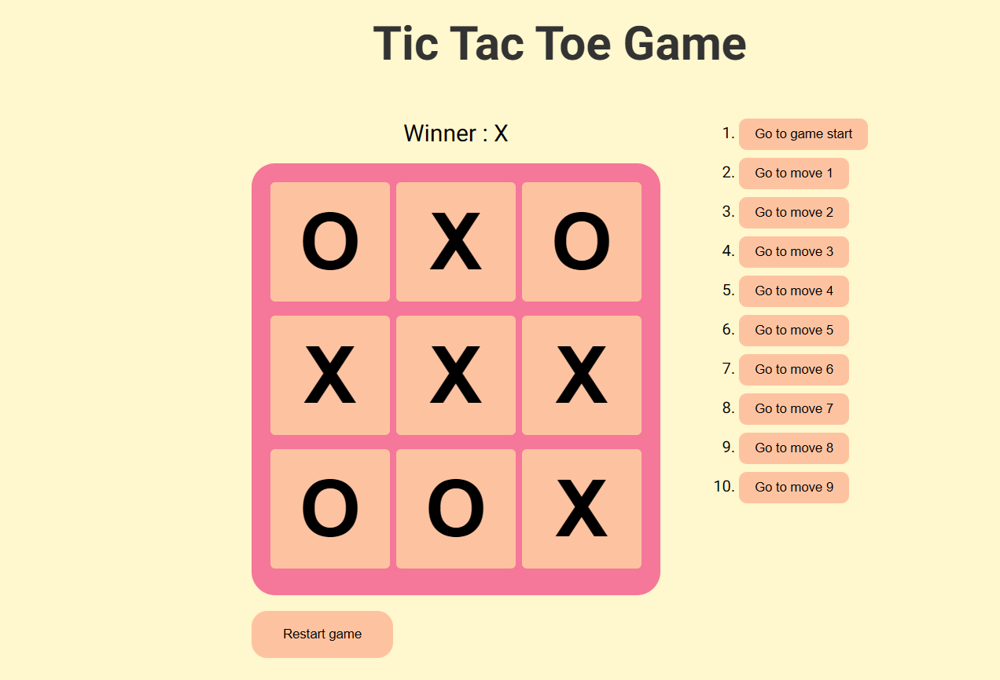

# Tic-Tac-Toe Game
A modern Tic-Tac-Toe game built with React. This project was an exercise to understand the core concepts of React, including state management, immutability and project architecture.

[Live Preview](https://yvan-dumas.github.io/React-TicTacToe/)

## Screenshots

## Features
- Play against a friend locally.
- Game state indicators : players turn, winner annoucement and draw.
- Time travel : keeps the game history in order to go back to a previous move.
- Restart button.

## Technologies used
- React
- CSS